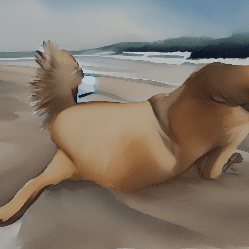

# pytorch-stable-diffusion-korean
PyTorch implementation of Stable Diffusion from scratch

## Stable Diffusion을 통한 잠재공간 산책

### 텍스트 프롬프트 간 보간

Stable Diffusion에서는 텍스트 프롬프트가 먼저 벡터로 인코딩됩니다.
그 인코딩은 확산 과정을 안내하는 데 사용됩니다.
잠재 인코딩 벡터는 모양을 갖습니다.
77x768(매우 큽니다!), Stable Diffusion에 텍스트 프롬프트를 주면
잠재 다양체의 한 지점에서만 이미지를 생성합니다.

이 다양함을 더 자세히 살펴보기 위해 두 텍스트 인코딩 사이를 보간할 수 있습니다.
보간된 지점에서 이미지를 생성합니다.

## 가중치 및 토크나이저 파일 다운로드:

1. Download `vocab.json` and `merges.txt` from https://huggingface.co/runwayml/stable-diffusion-v1-5/tree/main/tokenizer and save them in the `data` folder
2. Download `v1-5-pruned-emaonly.ckpt` from https://huggingface.co/runwayml/stable-diffusion-v1-5/tree/main and save it in the `data` folder

## 테스트된 미세 조정 모델:

Just download the `ckpt` file from any fine-tuned SD (up to v1.5).

1. InkPunk Diffusion: https://huggingface.co/Envvi/Inkpunk-Diffusion/tree/main
2. Illustration Diffusion (Hollie Mengert): https://huggingface.co/Envvi/Inkpunk-Diffusion/tree/main

## Special thanks

Special thanks to the following repositories:

1. https://github.com/CompVis/stable-diffusion/
1. https://github.com/divamgupta/stable-diffusion-tensorflow
1. https://github.com/kjsman/stable-diffusion-pytorch
1. https://github.com/huggingface/diffusers/

