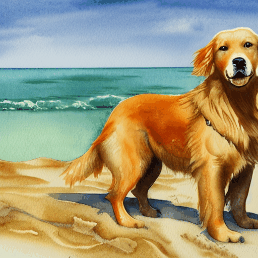
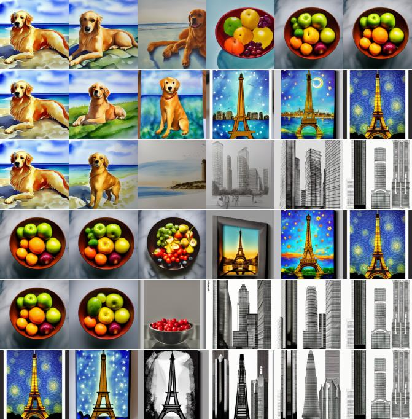
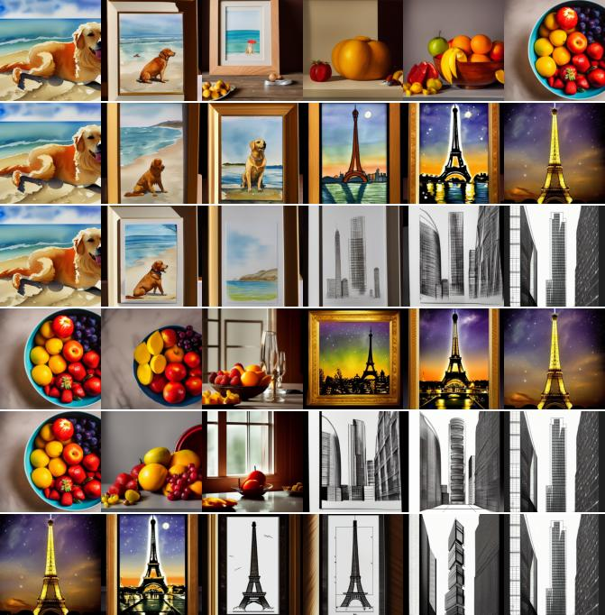

# Stable Diffusion을 통한 잠재공간 산책

]([https://colab.research.google.com/drive/여러분의노트북ID](https://colab.research.google.com/drive/1Li66ZpHs_XLDQw9lcYD7WNmqpvRFqfon))

### 텍스트 프롬프트 간 보간

  

### 수백 단계를 사용하여 훨씬 더 세밀한 보간

### 네 가지 프롬프트 사이를 보간 (w / noise)

  

### 네 가지 프롬프트 사이를 보간 (w / o noise)

  

### Step_size걷기의 크기를 늘리거나 줄이도록 조정하여 직접 시도

###  단일 프롬프트에 대한 확산 노이즈 공간을 통한 원형 이동(Cos, Sin)

## 가중치 및 토크나이저 파일 다운로드:

1. Download `vocab.json` and `merges.txt` from https://huggingface.co/runwayml/stable-diffusion-v1-5/tree/main/tokenizer and save them in the `data` folder
2. Download `v1-5-pruned-emaonly.ckpt` from https://huggingface.co/runwayml/stable-diffusion-v1-5/tree/main and save it in the `data` folder

## 테스트된 미세 조정 모델:

Just download the `ckpt` file from any fine-tuned SD (up to v1.5).

1. InkPunk Diffusion: https://huggingface.co/Envvi/Inkpunk-Diffusion/tree/main
2. Illustration Diffusion (Hollie Mengert): https://huggingface.co/Envvi/Inkpunk-Diffusion/tree/main

## Special thanks

Special thanks to the following repositories:

1. https://github.com/CompVis/stable-diffusion/
1. https://github.com/divamgupta/stable-diffusion-tensorflow
1. https://github.com/kjsman/stable-diffusion-pytorch
1. https://github.com/huggingface/diffusers/
2. https://keras.io/examples/generative/random_walks_with_stable_diffusion/

